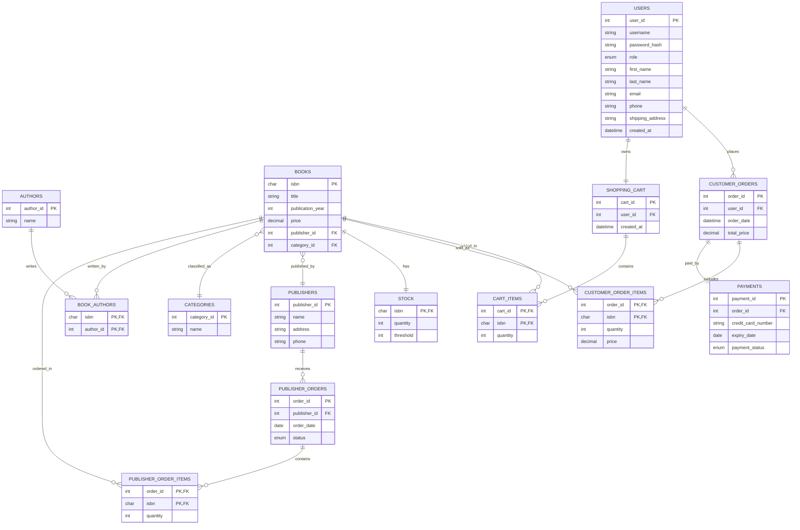

```mermaid
erDiagram

    USERS {
        int user_id PK
        string username
        string password_hash
        enum role
        string first_name
        string last_name
        string email
        string phone
        string shipping_address
        datetime created_at
    }

    PUBLISHERS {
        int publisher_id PK
        string name
        string address
        string phone
    }

    CATEGORIES {
        int category_id PK
        string name
    }

    AUTHORS {
        int author_id PK
        string name
    }

    BOOKS {
        char isbn PK
        string title
        int publication_year
        decimal price
        int publisher_id FK
        int category_id FK
    }

    BOOK_AUTHORS {
        char isbn PK, FK
        int author_id PK, FK
    }

    STOCK {
        char isbn PK, FK
        int quantity
        int threshold
    }

    PUBLISHER_ORDERS {
        int order_id PK
        int publisher_id FK
        date order_date
        enum status
    }

    PUBLISHER_ORDER_ITEMS {
        int order_id PK, FK
        char isbn PK, FK
        int quantity
    }

    SHOPPING_CART {
        int cart_id PK
        int user_id FK
        datetime created_at
    }

    CART_ITEMS {
        int cart_id PK, FK
        char isbn PK, FK
        int quantity
    }

    CUSTOMER_ORDERS {
        int order_id PK
        int user_id FK
        datetime order_date
        decimal total_price
    }

    CUSTOMER_ORDER_ITEMS {
        int order_id PK, FK
        char isbn PK, FK
        int quantity
        decimal price
    }

    PAYMENTS {
        int payment_id PK
        int order_id FK
        string credit_card_number
        date expiry_date
        enum payment_status
    }

    USERS ||--o{ CUSTOMER_ORDERS : places
    USERS ||--|| SHOPPING_CART : owns

    SHOPPING_CART ||--o{ CART_ITEMS : contains
    BOOKS ||--o{ CART_ITEMS : added_to

    CUSTOMER_ORDERS ||--o{ CUSTOMER_ORDER_ITEMS : includes
    BOOKS ||--o{ CUSTOMER_ORDER_ITEMS : sold_as

    CUSTOMER_ORDERS ||--|| PAYMENTS : paid_by

    BOOKS ||--|| STOCK : has
    BOOKS }o--|| PUBLISHERS : published_by
    BOOKS }o--|| CATEGORIES : classified_as

    BOOKS ||--o{ BOOK_AUTHORS : written_by
    AUTHORS ||--o{ BOOK_AUTHORS : writes

    PUBLISHERS ||--o{ PUBLISHER_ORDERS : receives
    PUBLISHER_ORDERS ||--o{ PUBLISHER_ORDER_ITEMS : contains
    BOOKS ||--o{ PUBLISHER_ORDER_ITEMS : ordered_in
```